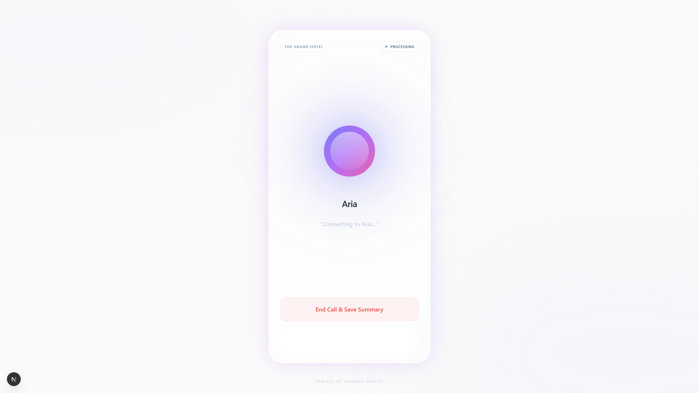
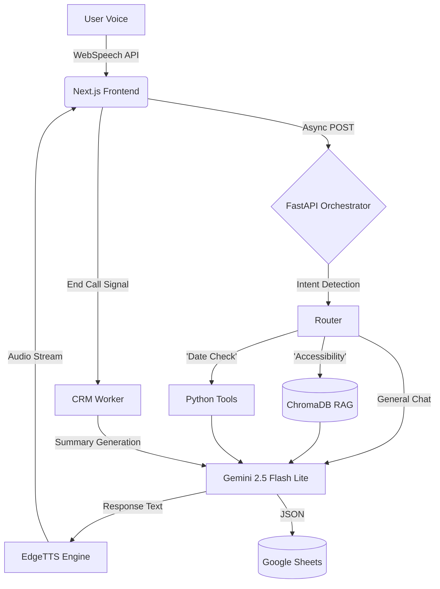

# Hotel Voice RAG Agent 🎙️
### Real-Time AI Orchestrator with Local RAG, Tool Use, and CRM Sync


> **[🔴 Watch Demo Video (YouTube)](https://youtu.be/BM4hye_zhOU?si=dY2A7_J3UUR85XTq)** > *See the agent handle booking logic, context switching, and CRM logging in real-time.*

> **[✨ Experience the High-Fidelity Version](https://youtube.com/shorts/-4hZ3AeqgKk)** > *Demo utilizing ElevenLabs for ultra-realistic voice synthesis.*

---

## 📸 UI Preview


*The "Living Glass" UI reacts to voice states in real-time: Listening (Green), Processing (Purple), and Saving (Amber).*

---

## 📖 Overview

**Gemini Voice RAG Agent** is a production-grade voice interface designed to solve the "latency problem" in conversational AI. 

Unlike standard chatbots, this system acts as an **Intelligent Orchestrator**. It dynamically routes user intent between deterministic **Tools** (Availability Calendar), probabilistic **Generative AI** (Gemini 2.0), and a **Local Knowledge Base** (RAG via ChromaDB).

The architecture prioritizes **speed and reliability**, achieving sub-second voice-to-voice latency by leveraging `gemini-2.0-flash-lite` for inference and `EdgeTTS` for synthesis. It features an **Event-Driven CRM Pipeline** that asynchronously logs call outcomes to Google Sheets without blocking the voice thread.

### 🚀 Key Capabilities
* **Hybrid Orchestration:** Seamlessly switches context between general chat, specific policy retrieval (RAG), and logic-based booking tools.
* **Local RAG Implementation:** Uses **ChromaDB** (persistent on-disk) to retrieve "long-tail" knowledge (e.g., accessibility policies) only when triggered by semantic intent.
* **Latency Optimized:** Achieves `<500ms` TTFB (Time to First Byte) using lightweight models and optimized FastAPI async handlers.
* **Event-Driven CRM:** Call summaries are generated and pushed to Google Sheets via background tasks, ensuring the UI remains non-blocking.
* **Responsible AI Guardrails:** Implements graceful degradation logic to intercept safety violations (toxicity, PII) and reroute users to safe conversational paths.

---

## 🛠️ Tech Stack & Architecture

This project demonstrates a modern **AI Engineering** stack, moving beyond simple API wrappers to a robust stateful system.

| Component | Technology | Role |
| :--- | :--- | :--- |
| **Frontend** | **Next.js 14 + Tailwind** | Real-time UI state management & Audio Context handling. |
| **Backend API** | **FastAPI (Python)** | Async orchestration layer & WebSocket management. |
| **LLM Engine** | **Gemini 2.0 Flash Lite** | High-throughput, low-latency reasoning engine. |
| **Vector DB** | **ChromaDB** | Local, persistent storage for Retrieval Augmented Generation. |
| **Voice Ops** | **EdgeTTS / WebSpeech API** | Hybrid voice stack for zero-cost latency optimization. |
| **Data Ops** | **Google Sheets API** | Synchronous CRM logging & structured data extraction. |

### System Architecture



---

## ⚡ Performance & Engineering Decisions

1. **Ingestion vs. Inference:** * The Knowledge Base is built via an offline ETL pipeline (`ingest.py`), separating heavy embedding operations from the runtime (`main.py`). This ensures **zero cold-start latency** for the agent.
2. **Blocking vs. Non-Blocking:** * Voice synthesis is **streaming** (non-blocking) for perceived speed.
* CRM Logging is **blocking** (synchronous) at the end of the call to guarantee data integrity before the session closes.


3. **Prompt Engineering:** * System prompts utilize **Chain-of-Thought** (CoT) instructions to force the model to summarize RAG context into "speakable" 2-sentence answers, avoiding the "Robot Reading a PDF" problem.

---

## 📦 Installation & Setup

### Prerequisites

* Python 3.10+
* Node.js 18+
* Google Cloud Service Account (for Sheets)
* Gemini API Key

### 1. Backend Setup

```bash
cd backend
pip install -r requirements.txt

# Create .env file
echo "GEMINI_API_KEY=your_key" > .env
echo "GOOGLE_CREDS_FILE=credentials.json" >> .env

# Build the Vector Database (Run once)
python ingest.py

# Start the API
python main.py

```

### 2. Frontend Setup

```bash
cd hotel-agent-ui
npm install

# Configure API Endpoint
echo "NEXT_PUBLIC_API_URL=http://localhost:8000" > .env.local

# Run Development Server
npm run dev

```

---

## 🛡️ License

This project is open-source and available under the [MIT License](https://www.google.com/search?q=LICENSE).

---

*Built by [Devansh Mistry](https://github.com/DevanshMistry890) —  AI Engineer.*